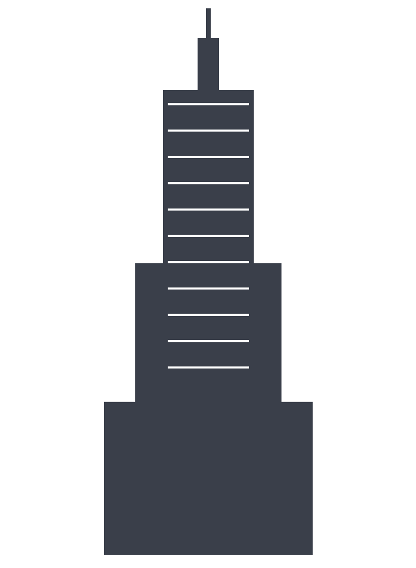

## A skyline that defined an era
<!-- layout: section -->

## The building at a glance
<!-- layout: title-content -->

- **Completed:** 1931, in just **410 days**
- **Height:** 381 m to the roof, **443 m** to the antenna tip
- **Floors:** 102
- **Structural frame:** riveted steel, ~57,000 tons

## Then and now
<!-- layout: two-column -->

:::: {.columns}
::: {.column width="50%"}
**1931**

- Tallest building in the world
- Built during the Great Depression
- ~3,400 workers at peak
:::
::: {.column width="50%"}
**Today**

- A National Historic Landmark
- LEED Gold energy retrofit
- ~4 million visitors a year
:::
::::

## The structural system
<!-- layout: title-content -->

A braced steel moment frame carries gravity and wind loads down to bedrock.
For a slender tower, wind pressure governs the lateral design:

$$ q = \tfrac{1}{2}\,\rho\,V^{2} $$

::: {.callout-note title="Why steel?"}
A riveted steel frame let crews erect about **four and a half floors per
week** — the pace that made the 410-day schedule possible.
:::

## Reaching for the sky
<!-- layout: image-caption -->

{width=42%}

## Building speed
<!-- layout: code -->

```text
Steel frame:      ~23 weeks
Full tower:        410 days  (foundation to ribbon-cutting)
Floors per week:  ~4.5       (at peak erection)
```

::: {.notes}
The 410-day figure runs from foundation work to opening day, 1 May 1931.
Emphasise that the schedule was a feat of logistics and prefabrication,
not just steel.
:::

## A monument to building well, fast
<!-- layout: quote -->

> The Empire State Building shows what people can build when they decide
> to build it fast — and build it to last.
>
> — On the 1931 construction
