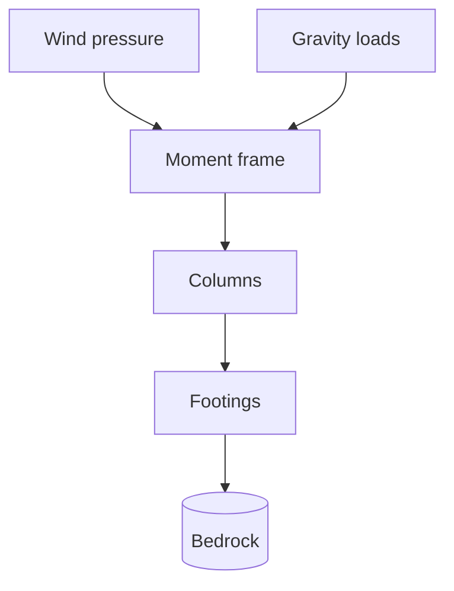

## A skyline that defined an era
<!-- layout: section -->

## Agenda
<!-- layout: agenda -->

::: {.agenda}
- The building at a glance
- A record-breaking schedule
- The structural system
- Wind: the load that governs
- Then and now
:::

## The building at a glance
<!-- layout: big-stat -->

:::: {.stats}
::: {.stat}
**443 m**

[height to antenna tip]{.stat-label}
:::
::: {.stat}
**102**

[floors]{.stat-label}
:::
::: {.stat}
**410**

[days to build]{.stat-label}
:::
::: {.stat}
**57,000 t**

[steel frame]{.stat-label}
:::
::::

## What made it possible
<!-- layout: cards -->

:::: {.cards}
::: {.card}
#### Riveted steel
A prefabricated, shop-riveted frame erected at roughly **four and a half
floors per week**.
:::
::: {.card}
#### Logistics
A railhead schedule delivered steel to the site **within days** of rolling
at the mill.
:::
::: {.card}
#### Repetition
A typical floor plate repeated up the tower, so crews refined one workflow
and ran it 80+ times.
:::
::::

## A record-breaking schedule
<!-- layout: timeline -->

::: {.timeline}
- **Jan 1930** — Excavation and foundations to bedrock
- **Mar 1930** — Steel erection begins
- **Sep 1930** — Frame tops out, 102 floors
- **May 1931** — Ribbon-cutting, 410 days from start
:::

## The structural system
<!-- layout: title-content -->

A braced steel moment frame carries gravity and wind loads down to bedrock.
For a slender tower, wind pressure governs the lateral design:

$$ q = \tfrac{1}{2}\,\rho\,V^{2} $$

::: {.callout-note title="Why steel?"}
A riveted steel frame let crews erect about **four and a half floors per
week** — the pace that made the 410-day schedule possible.
:::

## How loads travel to bedrock
<!-- layout: title-content -->



::: {.notes}
Walk the audience down the load path: lateral wind and vertical gravity
both resolve into the moment frame, then columns, footings and finally the
Manhattan schist bedrock.
:::

## The load path, as a component view
<!-- layout: title-content -->

```nomnoml
[Wind] -> [Moment frame]
[Gravity] -> [Moment frame]
[Moment frame] -> [Columns]
[Columns] -> [Footings]
[Footings] -> [Bedrock]
```

## Reaching for the sky
<!-- layout: image-left -->

:::: {.columns}
::: {.column width="42%"}

:::
::: {.column width="58%"}
- Stepped Art Deco massing
- Setbacks shed wind and bring light to the street
- A mooring mast crowns the tower at 381 m
:::
::::

## Then and now
<!-- layout: two-column -->

:::: {.columns}
::: {.column width="50%"}
**1931**

- Tallest building in the world
- Built during the Great Depression
- ~3,400 workers at peak
:::
::: {.column width="50%"}
**Today**

- A National Historic Landmark
- LEED Gold energy retrofit
- ~4 million visitors a year
:::
::::

## Steel vs. concrete, for 1931
<!-- layout: comparison -->

:::: {.columns}
::: {.column width="50%"}
**Steel frame**

- Fast, repeatable erection
- Light for its strength
- Easy to rivet on site
:::
::: {.column width="50%"}
**Concrete frame**

- Slow formwork and curing
- Heavier foundations
- Less suited to the schedule
:::
::::

## Building speed
<!-- layout: code -->

```text
Steel frame:      ~23 weeks
Full tower:        410 days  (foundation to ribbon-cutting)
Floors per week:  ~4.5       (at peak erection)
```

## In the architect's words
<!-- layout: quote-portrait -->

:::: {.columns}
::: {.column width="32%"}

:::
::: {.column width="68%"}
> A monument should look as if it had grown out of the rock it stands on —
> fast to raise, but built to last.
>
> — On the 1931 construction
:::
::::

## A monument to building well, fast
<!-- layout: quote -->

> The Empire State Building shows what people can build when they decide
> to build it fast — and build it to last.
>
> — On the 1931 construction
