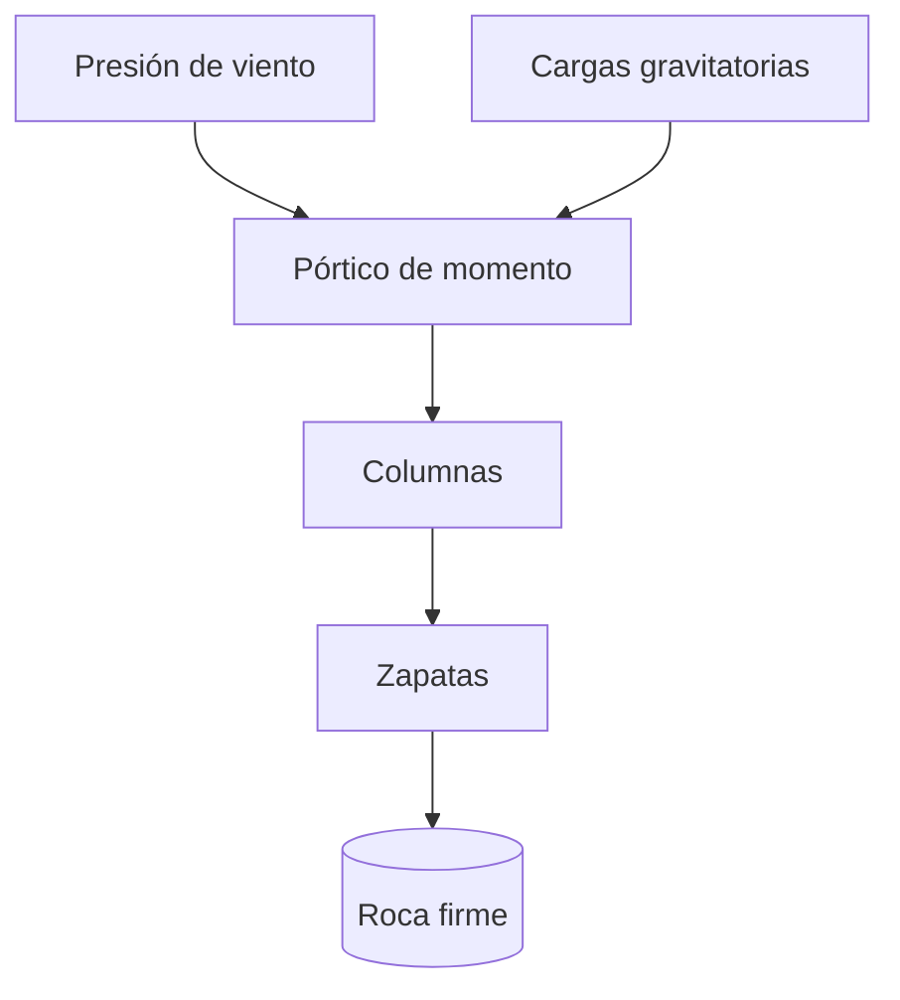

## Un perfil urbano que definió una era
<!-- layout: section -->

## Agenda
<!-- layout: agenda -->

::: {.agenda}
- El edificio en cifras
- Un calendario récord
- El sistema estructural
- Viento: la carga que gobierna
- Entonces y hoy
:::

## El edificio en cifras
<!-- layout: big-stat -->

:::: {.stats}
::: {.stat}
**443 m**

[altura hasta la punta de la antena]{.stat-label}
:::
::: {.stat}
**102**

[pisos]{.stat-label}
:::
::: {.stat}
**410**

[días de construcción]{.stat-label}
:::
::: {.stat}
**57,000 t**

[estructura de acero]{.stat-label}
:::
::::

## Lo que lo hizo posible
<!-- layout: cards -->

:::: {.cards}
::: {.card}
#### Acero remachado
Una estructura prefabricada y remachada en taller, erigida a razón de aproximadamente **cuatro pisos y medio por semana**.
:::
::: {.card}
#### Logística
Un programa ferroviario coordinado entregaba el acero en obra **en pocos días** tras salir del laminador.
:::
::: {.card}
#### Repetición
Una planta de piso típica se repetía a lo largo de la torre, de modo que las cuadrillas perfeccionaron un único procedimiento y lo ejecutaron más de 80 veces.
:::
::::

## Un calendario récord
<!-- layout: timeline -->

::: {.timeline}
- **Ene 1930** — Excavación y cimentaciones hasta la roca firme
- **Mar 1930** — Inicio del montaje de la estructura de acero
- **Sep 1930** — Coronación de la estructura, 102 pisos
- **May 1931** — Inauguración, 410 días desde el inicio
:::

## El sistema estructural
<!-- layout: title-content -->

Un pórtico de acero arriostrado con rigidez de nudo transmite las cargas gravitatorias y de viento hasta la roca firme. En una torre esbelta, la presión de viento gobierna el diseño lateral:

$$ q = \tfrac{1}{2}\,\rho\,V^{2} $$

::: {.callout-note title="¿Por qué acero?"}
Un pórtico de acero remachado permitió a las cuadrillas erigir aproximadamente **cuatro pisos y medio por semana** — el ritmo que hizo posible el calendario de 410 días.
:::

## Cómo las cargas llegan hasta la roca
<!-- layout: title-content -->



::: {.notes}
Guiar al público a lo largo de la trayectoria de cargas: el viento lateral y la gravedad vertical se resuelven en el pórtico de momento, luego en las columnas, las zapatas y finalmente en la roca de esquisto de Manhattan.
:::

## La trayectoria de cargas, como vista de componentes
<!-- layout: title-content -->

```nomnoml
[Viento] -> [Pórtico de momento]
[Gravedad] -> [Pórtico de momento]
[Pórtico de momento] -> [Columnas]
[Columnas] -> [Zapatas]
[Zapatas] -> [Roca firme]
```

## Alcanzando el cielo
<!-- layout: image-left -->

:::: {.columns}
::: {.column width="42%"}

:::
::: {.column width="58%"}
- Volumetría Art Déco escalonada
- Los retranqueos reducen el viento y llevan luz a la calle
- Un mástil de amarre corona la torre a 381 m
:::
::::

## Entonces y hoy
<!-- layout: two-column -->

:::: {.columns}
::: {.column width="50%"}
**1931**

- El edificio más alto del mundo
- Construido durante la Gran Depresión
- ~3,400 trabajadores en el pico de obra
:::
::: {.column width="50%"}
**Hoy**

- Monumento Histórico Nacional
- Retrofitado energéticamente con certificación LEED Gold
- ~4 millones de visitantes al año
:::
::::

## Acero vs. concreto, en 1931
<!-- layout: comparison -->

:::: {.columns}
::: {.column width="50%"}
**Estructura de acero**

- Montaje rápido y repetible
- Ligero en relación con su resistencia
- Fácil de remachar en obra
:::
::: {.column width="50%"}
**Estructura de concreto**

- Encofrado y curado lentos
- Cimentaciones más pesadas
- Menos adecuada para el calendario propuesto
:::
::::

## Velocidad de construcción
<!-- layout: code -->

```text
Estructura de acero:   ~23 semanas
Torre completa:         410 días  (de cimentación a inauguración)
Pisos por semana:      ~4.5       (en el pico del montaje)
```

## En palabras del arquitecto
<!-- layout: quote-portrait -->

:::: {.columns}
::: {.column width="32%"}

:::
::: {.column width="68%"}
> Un monumento debería parecer que ha crecido de la roca sobre la que se asienta —
> rápido de levantar, pero construido para perdurar.
>
> — Sobre la construcción de 1931
:::
::::

## Un monumento a construir bien y rápido
<!-- layout: quote -->

> El Empire State Building demuestra lo que las personas pueden construir cuando deciden
> hacerlo rápido — y construirlo para perdurar.
>
> — Sobre la construcción de 1931

## Aviso
<!-- layout: title-content -->

[Esta presentación es un ejemplo con fines demostrativos. Su contenido es ilustrativo y no ha sido revisado en detalle; no debe usarse como base para decisiones de ingeniería ni de ningún otro tipo. Se entrega tal cual, sin garantía de ningún tipo.]{.muted}
