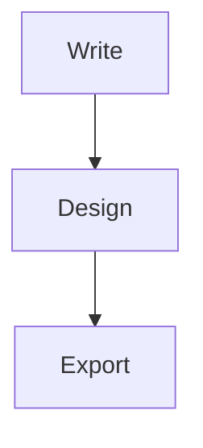

## Welcome to epy_slides
<!-- layout: section -->

## What you build here
<!-- layout: title-content -->

- Write a deck once, in plain **Markdown**
- See a live **reveal.js** preview as you type
- Export the same source to **PDF**, **HTML** and **PowerPoint**

::: {.callout-note title="One source, three formats"}
Everything in this manual is itself an epy_slides deck. Open it from
*Help ▸ User manual* at any time.
:::

## The editor at a glance
<!-- layout: image-caption -->

{width=78%}

## The toolbar, left to right
<!-- layout: cards -->

:::: {.cards}
::: {.card}
#### Slides
Insert a new slide from a layout, or a blank slide break.
:::
::: {.card}
#### Content
Bullets, columns, quotes, images, tables, equations, code, callouts,
diagrams and speaker notes.
:::
::: {.card}
#### Export
PDF, HTML and PowerPoint — plus the live theme and language switches in
*View*.
:::
::::

## Writing slides
<!-- layout: title-content -->

- A line that starts with `## ` begins a **new slide**
- A single `# ` begins a **section divider**
- A comment such as `<!-- layout: two-column -->` picks the slide layout

::: {.callout-tip title="Keep it plain"}
You never leave Markdown. Every menu just drops the right text at the cursor.
:::

## The New Slide dialog
<!-- layout: image-caption -->

{width=42%}

## The layouts you can pick
<!-- layout: cards -->

:::: {.cards}
::: {.card}
#### Structure
Section · Title + bullets · Two columns · Comparison · Blank
:::
::: {.card}
#### Imagery
Image + caption · Full-bleed · Image left · Image right · Quote + portrait
:::
::: {.card}
#### Emphasis
Big numbers · Agenda · Cards · Timeline · Quote · Code
:::
::::

## Design components
<!-- layout: big-stat -->

:::: {.stats}
::: {.stat}
**16**

[slide layouts]{.stat-label}
:::
::: {.stat}
**9**

[colour themes]{.stat-label}
:::
::: {.stat}
**3**

[export formats]{.stat-label}
:::
::::

## A timeline, for example
<!-- layout: timeline -->

::: {.timeline}
- **Write** — type Markdown, watch the preview
- **Design** — pick a layout and a theme
- **Export** — PDF, HTML or PowerPoint
:::

## Figures, tables and equations
<!-- layout: two-column -->

:::: {.columns}
::: {.column width="50%"}
**Figure**

{width=92%}
:::
::: {.column width="50%"}
**Table**

{width=88%}
:::
::::

## Equations render with MathJax
<!-- layout: two-column -->

:::: {.columns}
::: {.column width="46%"}
{width=98%}
:::
::: {.column width="54%"}
For a slender tower, wind pressure governs:

$$ q = \tfrac{1}{2}\,\rho\,V^{2} $$

In PowerPoint, equations export as images.
:::
::::

## Diagrams, two engines
<!-- layout: two-column -->

:::: {.columns}
::: {.column width="50%"}
**Mermaid** — flowcharts


:::
::: {.column width="50%"}
**nomnoml** — UML-style

```nomnoml
[Deck] -> [Slide]
[Slide] -> [Block]
```
:::
::::

::: {.notes}
Both diagram engines read the active theme's colours, so a diagram always
matches the deck. They render in HTML and PDF, and the PowerPoint export
rasterizes each one to a themed image so the slide keeps the picture.
:::

## Themes
<!-- layout: image-caption -->

{width=46%}

## Presentation properties
<!-- layout: image-caption -->

{width=44%}

## Logo and watermark travel with the deck
<!-- layout: title-content -->

- A picked **logo** or **watermark** is copied into the deck's `figures/`
  folder, so the deck stays portable
- The watermark shows faintly behind every slide and is stamped into the PDF
- The preview repaints the moment you accept the dialog

## Exporting
<!-- layout: cards -->

:::: {.cards}
::: {.card}
#### PDF
One slide per landscape page, with metadata and the watermark stamped in.
:::
::: {.card}
#### HTML
A standalone reveal.js slideshow — arrow keys navigate, `F` for full screen.
:::
::: {.card}
#### PowerPoint
Standard slide layouts with the theme's colours, fonts and speaker notes.
:::
::::

## Present and share
<!-- layout: two-column -->

:::: {.columns}
::: {.column width="50%"}
**Present**

- Arrow keys navigate
- `S` opens speaker notes
- `F` goes full screen
:::
::: {.column width="50%"}
**Share**

- Export to HTML for the web
- Export to PDF to print
- Export to PPTX for PowerPoint
:::
::::

## Python API — render without the app
<!-- layout: code -->

```python
from pathlib import Path
from epy_slides.renderer import render_revealjs, export_pptx
from epy_slides import themes
from epy_slides._revealjs_theme import reveal_css_for

deck = Path("talk.md").read_text(encoding="utf-8")
css = reveal_css_for(themes.get("corporate"))

# Standalone reveal.js slideshow (HTML)
html = render_revealjs(deck, theme_css=css, for_export=True)
Path("talk.html").write_text(html, encoding="utf-8")

# PowerPoint, using the theme's reference deck
export_pptx(deck, Path("talk.pptx"), theme_id="corporate")
```

## Python API — themes and PDF
<!-- layout: title-content -->

- `themes.THEMES` lists the nine theme ids; `reveal_css_for(theme)` builds
  the deck CSS from any of them
- The **PDF** export drives Qt WebEngine (reveal's print mode), so it needs
  a `QApplication`
- The reference script
  `examples/empire_state_building/render_all_themes.py` renders one deck to
  **HTML + PPTX + PDF** for every theme — copy it as a starting point

## You are ready
<!-- layout: quote -->

> The best presentation is the one you can keep editing as plain text.
>
> — ANM Ingeniería
