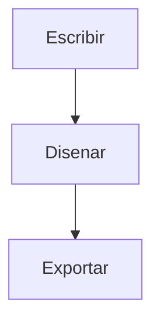

## Bienvenido a epy_slides
<!-- layout: section -->

## Qué construye aquí
<!-- layout: title-content -->

- Escriba la presentación una sola vez, en **Markdown**
- Vea una vista previa **reveal.js** en vivo mientras escribe
- Exporte la misma fuente a **PDF**, **HTML** y **PowerPoint**

::: {.callout-note title="Una fuente, tres formatos"}
Todo este manual es, en sí mismo, una presentación de epy_slides. Ábralo
cuando quiera desde *Ayuda ▸ Manual de usuario*.
:::

## El editor de un vistazo
<!-- layout: image-caption -->

{width=78%}

## La barra de herramientas, de izquierda a derecha
<!-- layout: cards -->

:::: {.cards}
::: {.card}
#### Diapositivas
Inserte una diapositiva desde un layout, o un salto de diapositiva en blanco.
:::
::: {.card}
#### Contenido
Viñetas, columnas, citas, imágenes, tablas, ecuaciones, código, llamados,
diagramas y notas del orador.
:::
::: {.card}
#### Exportar
PDF, HTML y PowerPoint — más el cambio de tema e idioma en vivo desde *Ver*.
:::
::::

## Escribir diapositivas
<!-- layout: title-content -->

- Una línea que empieza con `## ` inicia una **nueva diapositiva**
- Un solo `# ` inicia un **divisor de sección**
- Un comentario como `<!-- layout: two-column -->` elige el layout

::: {.callout-tip title="Todo sigue siendo texto"}
Nunca sale de Markdown. Cada menú solo deja el texto correcto en el cursor.
:::

## El diálogo Nueva diapositiva
<!-- layout: image-caption -->

{width=42%}

## Los layouts que puede elegir
<!-- layout: cards -->

:::: {.cards}
::: {.card}
#### Estructura
Sección · Título + viñetas · Dos columnas · Comparación · En blanco
:::
::: {.card}
#### Imágenes
Imagen + pie · A sangre · Imagen izquierda · Imagen derecha · Cita + retrato
:::
::: {.card}
#### Énfasis
Números grandes · Agenda · Tarjetas · Línea de tiempo · Cita · Código
:::
::::

::: {.callout-tip title="Elija a simple vista"}
Cada entrada de la lista Nueva diapositiva muestra una pequeña vista previa
esquemática del layout, así elige la estructura de un vistazo — no solo por
su nombre.
:::

## Componentes de diseño
<!-- layout: big-stat -->

:::: {.stats}
::: {.stat}
**16**

[layouts de diapositiva]{.stat-label}
:::
::: {.stat}
**9**

[temas de color]{.stat-label}
:::
::: {.stat}
**3**

[formatos de exportación]{.stat-label}
:::
::::

## Una línea de tiempo, por ejemplo
<!-- layout: timeline -->

::: {.timeline}
- **Escriba** — teclee Markdown, observe la vista previa
- **Diseñe** — elija un layout y un tema
- **Exporte** — PDF, HTML o PowerPoint
:::

## Figuras, tablas y ecuaciones
<!-- layout: two-column -->

:::: {.columns}
::: {.column width="50%"}
**Figura**

{width=92%}
:::
::: {.column width="50%"}
**Tabla**

{width=88%}
:::
::::

## Las ecuaciones se renderizan con MathJax
<!-- layout: two-column -->

:::: {.columns}
::: {.column width="46%"}
{width=98%}
:::
::: {.column width="54%"}
En una torre esbelta, la presión de viento gobierna:

$$ q = \tfrac{1}{2}\,\rho\,V^{2} $$

En PowerPoint, las ecuaciones se exportan como imágenes.
:::
::::

## Diagramas, dos motores
<!-- layout: two-column -->

:::: {.columns}
::: {.column width="50%"}
**Mermaid** — diagramas de flujo


:::
::: {.column width="50%"}
**nomnoml** — estilo UML

```nomnoml
[Presentacion] -> [Diapositiva]
[Diapositiva] -> [Bloque]
```
:::
::::

::: {.notes}
Ambos motores de diagramas leen los colores del tema activo, así que un
diagrama siempre combina con la presentación. Se renderizan en HTML y PDF, y
la exportación a PowerPoint los rasteriza a una imagen con el color del tema
para conservar el dibujo.
:::

## Temas
<!-- layout: image-caption -->

{width=46%}

## Explore los temas en una galería
<!-- layout: image-caption -->

{width=58%}

## Propiedades de la presentación
<!-- layout: image-caption -->

{width=44%}

## El logo y la marca de agua viajan con la presentación
<!-- layout: title-content -->

- Un **logo** o **marca de agua** elegido se copia a la carpeta `figures/`
  de la presentación, para que siga siendo portable
- La marca de agua aparece tenue detrás de cada diapositiva y se estampa
  en el PDF
- La vista previa se repinta apenas acepta el diálogo

## Exportar
<!-- layout: cards -->

:::: {.cards}
::: {.card}
#### PDF
Una diapositiva por página horizontal, con metadatos y la marca de agua
estampada.
:::
::: {.card}
#### HTML
Una presentación reveal.js independiente — las flechas navegan, `F` pantalla completa.
:::
::: {.card}
#### PowerPoint
Layouts estándar con los colores, fuentes y notas del orador del tema.
:::
::::

## Presentar y compartir
<!-- layout: two-column -->

:::: {.columns}
::: {.column width="50%"}
**Presentar**

- Las flechas navegan
- `S` abre las notas del orador
- `F` pasa a pantalla completa
:::
::: {.column width="50%"}
**Compartir**

- Exporte a HTML para la web
- Exporte a PDF para imprimir
- Exporte a PPTX para PowerPoint
:::
::::

## API de Python — renderizar sin la app
<!-- layout: code -->

```python
from pathlib import Path
from epy_slides.renderer import render_revealjs, export_pptx
from epy_slides import themes
from epy_slides._revealjs_theme import reveal_css_for

deck = Path("charla.md").read_text(encoding="utf-8")
css = reveal_css_for(themes.get("corporate"))

# Presentacion reveal.js independiente (HTML)
html = render_revealjs(deck, theme_css=css, for_export=True)
Path("charla.html").write_text(html, encoding="utf-8")

# PowerPoint, usando la plantilla del tema
export_pptx(deck, Path("charla.pptx"), theme_id="corporate")
```

## API de Python — temas y PDF
<!-- layout: title-content -->

- `themes.THEMES` lista los nueve ids de tema; `reveal_css_for(theme)`
  construye el CSS de la presentación a partir de cualquiera
- La exportación a **PDF** usa Qt WebEngine (el modo impresión de reveal),
  así que requiere un `QApplication`
- El script de referencia
  `examples/empire_state_building/render_all_themes.py` renderiza una
  presentación a **HTML + PPTX + PDF** por cada tema — cópielo como punto
  de partida

## Ya está listo
<!-- layout: quote -->

> La mejor presentación es la que puede seguir editando como texto plano.
>
> — ANM Ingeniería
